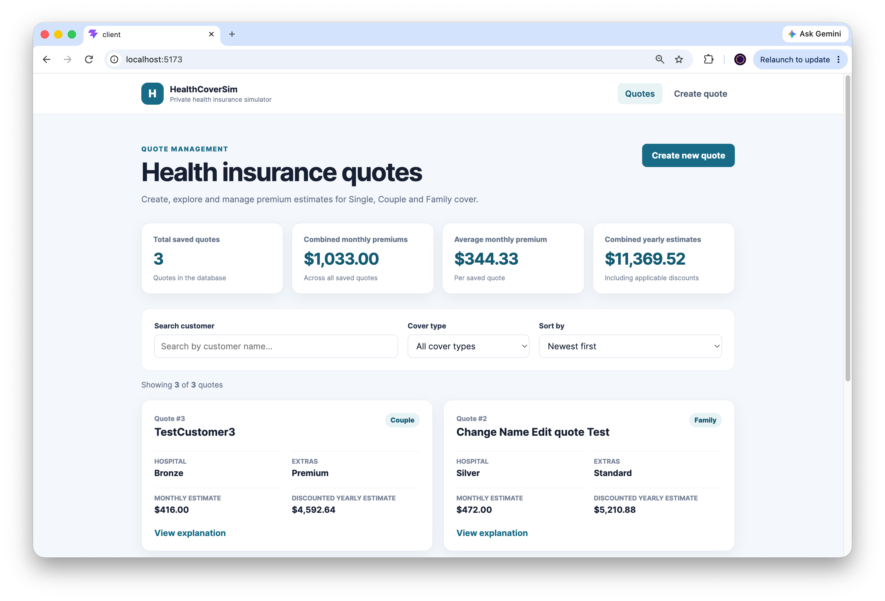
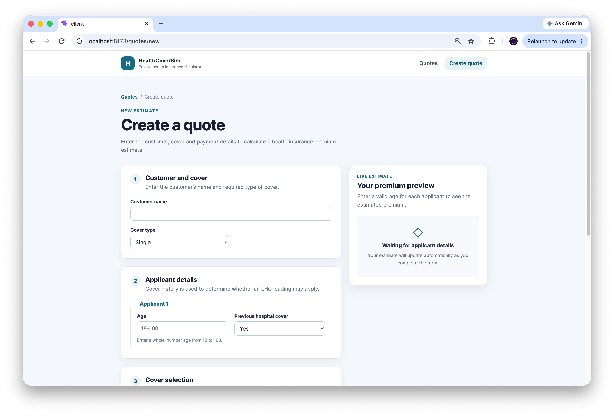
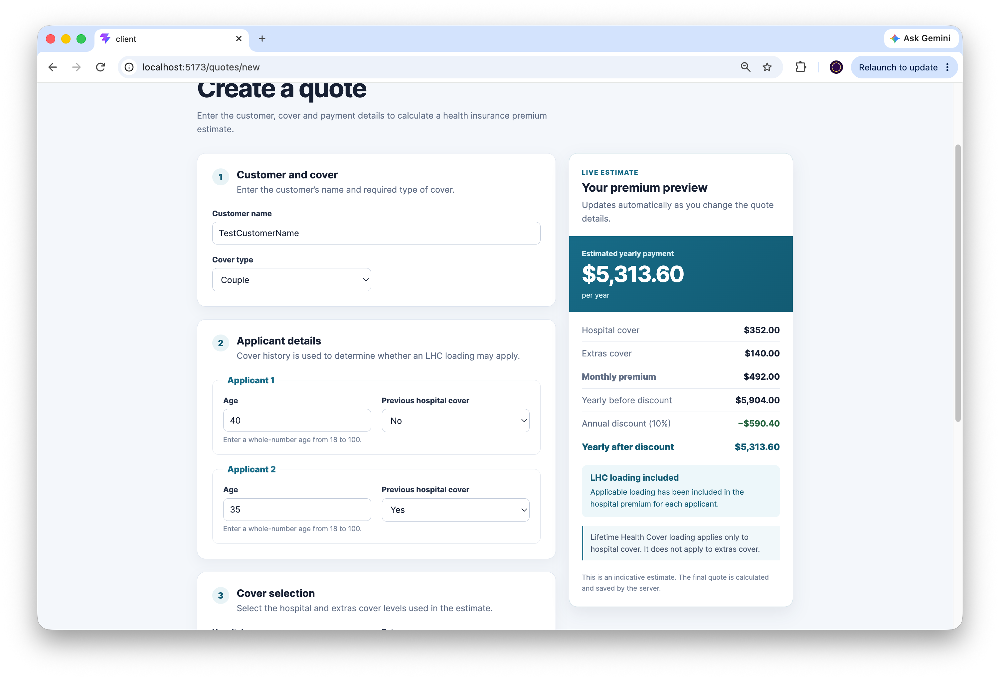
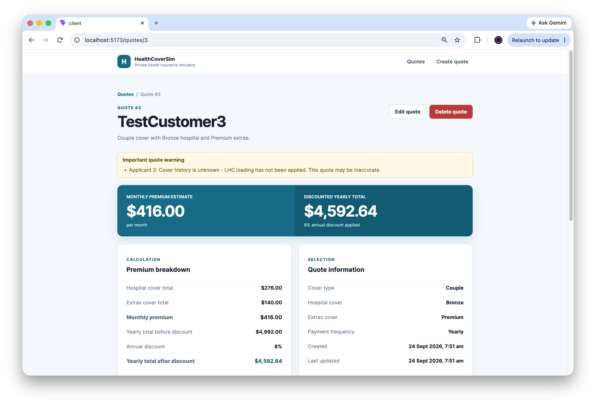

# HealthCoverSim

**A private health insurance quote simulator**  
Cloud-Based Web Application — academic project  
**Ruixin Huang · La Trobe University Student ID: 23025563**

HealthCoverSim is a full-stack web application for creating, viewing, updating, and deleting simulated private health insurance quotes. It calculates indicative premiums for Single, Couple, and Family cover, including applicable Lifetime Health Cover (LHC) loading and annual-payment discounts. It is an educational simulator, not an insurer or a source of real insurance quotations.

## Application screenshots

### Quote dashboard


### Create a quote


### Live premium preview


### Saved quote and calculation breakdown


## Features

- Create, view, edit, and delete insurance quotes.
- Search, filter, and sort saved quotes on the dashboard.
- Calculate hospital and extras premiums for one or two adult applicants.
- Apply per-applicant LHC loading to hospital cover only.
- Add the automatic Family upgrade fee and optional annual-payment discount.
- Display a live estimate while completing the form and an explanation on the saved quote.
- Validate required fields, applicant ages, cover selections, and discount values.
- Warn when an applicant's previous hospital cover history is **Not sure**.

## Technology stack

| Layer | Technology |
| --- | --- |
| Frontend | React, Vite, React Router, CSS |
| Backend | Node.js, Express |
| Database | SQLite via `better-sqlite3` |
| Testing | Node.js built-in test runner, Supertest |

## Install and run locally

**Prerequisites:** Node.js and npm. Use two terminal windows, one for the API and one for the frontend.

1. Clone the repository and enter its directory:

   ```bash
   git clone https://github.com/23025563-latrobe/health-cover-sim.git
   cd health-cover-sim
   ```

   If the repository is private, GitHub access is required.

2. Install and start the backend in terminal 1:

   ```bash
   cd server
   npm install
   npm run dev
   ```

   The API runs at `http://localhost:3000`. Check `http://localhost:3000/api/health` for the health response.

3. Install and start the frontend in terminal 2, from the repository root:

   ```bash
   cd client
   npm install
   npm run dev
   ```

   Open the local URL displayed by Vite (normally `http://localhost:5173`). The Vite development proxy forwards `/api` requests to the backend on port 3000, so **both services must be running**.

### Run checks

From `server/`:

```bash
npm test
```

From `client/`:

```bash
npm run lint
npm run build
```

## Database creation and initialisation

The application uses a local SQLite database. When the backend starts, `server/src/db/database.js` creates the `server/data/` directory if necessary, opens `server/data/healthcoversim.db`, reads `server/db/init.sql`, and executes the schema. No separate database server or manual SQL import is needed. Existing saved quotes remain in the database across normal application restarts.

The automated tests use a separate `healthcoversim-test.db` file when `NODE_ENV=test`; do not use test data as a substitute for real application records. Local database files are excluded from version control.

## How the quote calculation works

All prices below are **simulated AUD amounts per month**. The backend calculator is the authoritative calculation when a quote is saved.

| Hospital level | Base price per adult |
| --- | ---: |
| None | $0 |
| Basic | $90 |
| Bronze | $120 |
| Silver | $160 |
| Gold | $220 |

| Extras level | Price per adult |
| --- | ---: |
| None | $0 |
| Basic | $25 |
| Standard | $45 |
| Premium | $70 |

For each adult, the calculator determines hospital cost from the selected hospital base price and any applicable LHC loading. If previous hospital cover history is **No** and age is above 30, the loading is **2% for each year above age 30**. If history is **Yes**, no loading is applied. If history is **Not sure**, no loading is applied and a warning explains that the estimate may be inaccurate. No LHC loading is applied when hospital cover is **None**. LHC loading affects **hospital cover only**, not extras.

The monthly premium is:

```text
Sum of each adult's hospital cost
+ (extras price × number of adults)
+ Family upgrade fee, if applicable
= monthly premium
```

The yearly total before discount is `monthly premium × 12`. An annual-payment discount between 0% and 10% applies **only** when payment frequency is Yearly. For Monthly payment, the discount is zero. The displayed final payable total is the monthly premium for Monthly payment, or the discounted yearly total for Yearly payment.

### Family cover

Family cover includes **two adult applicants**. Each adult's hospital premium (including their own applicable LHC loading) is calculated separately, and extras are charged for both adults. The application then adds a **single $30/month Family upgrade fee**. Children's ages are not entered and children are not priced individually.

**Worked example:** Family cover; Applicant 1 age 40 with previous hospital cover **No**; Applicant 2 age 35 with history **Yes**; Silver hospital cover; Standard extras; Yearly payment; 5% discount.

| Component | Calculation | Amount |
| --- | --- | ---: |
| Applicant 1 hospital | $160 × 1.20 | $192.00 |
| Applicant 2 hospital | $160 × 1.00 | $160.00 |
| Hospital total | $192 + $160 | $352.00 |
| Extras total | $45 × 2 | $90.00 |
| Family upgrade | Added once | $30.00 |
| Monthly premium | $352 + $90 + $30 | **$472.00** |
| Yearly before discount | $472 × 12 | $5,664.00 |
| Yearly after 5% discount | $5,664 × 0.95 | **$5,380.80** |

## Input validation

Applicant ages must be whole numbers between **18 and 100**. Applicant 2's age and hospital-cover history are required for Couple and Family cover, but are not required for Single cover. The annual-payment discount must be between **0% and 10%**. The form provides user-facing feedback; the backend validates submitted data independently.

## AI assistance and individual contribution
I used AI tools, including ChatGPT, to support project planning, clarify technical concepts, explore implementation approaches, and assist with troubleshooting and code refinement.
I independently analysed the assignment requirements, defined the project scope, implemented and integrated the application, and verified its functionality through testing and manual review. I also reviewed the premium calculations, user interface, and documentation to ensure that the final project met the assignment requirements.
The final implementation, validation, and submission remain my responsibility.

## Limitation

HealthCoverSim uses fixed, illustrative prices and simplified LHC rules. It does **not** connect to real insurers, obtain current policy prices, or assess all factors that affect an actual insurance quotation. Its estimates are therefore for learning and demonstration only.

## Academic use and disclaimer

© 2026 Ruixin Huang · La Trobe University Student ID: 23025563. Developed for the Cloud-Based Web Application course. For educational and demonstration purposes only; simulated estimates do not represent actual insurance products or financial advice.
